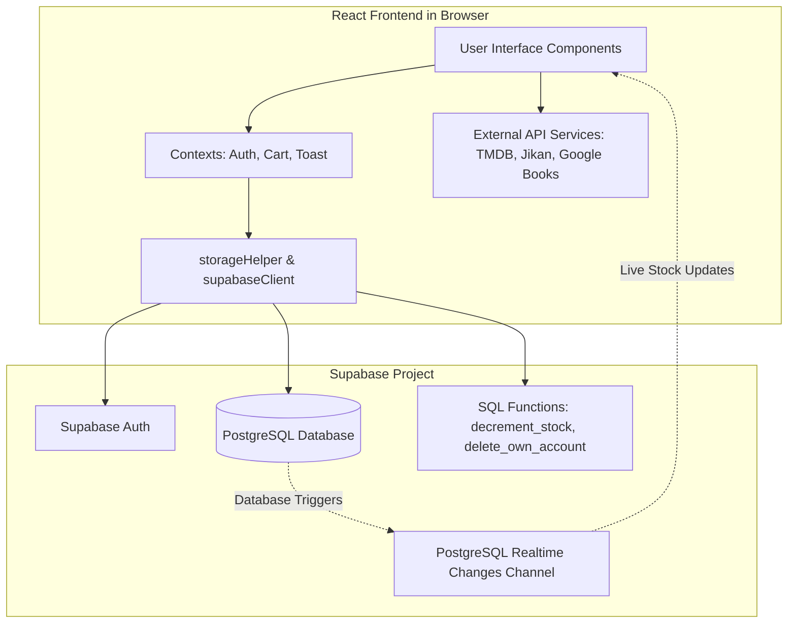

# Orbit — Physical Media Marketplace

Orbit is a retro-inspired, high-performance physical media marketplace designed for browsing, buying, and selling print and physical media (including **Anime releases, Manga volumes, Books, Comics, and Movies**). Built using Vite, React, and Supabase, Orbit provides collectors and enthusiasts with a distinct browsing experience centered around a library-shelf aesthetic.

---

## 🎨 Overview

Orbit departs from the sterile, modular grid styling of standard e-commerce websites. The user interface mimics the experience of walking through a curated bookstore or library collection:

*   **Shelving Grid Layout:** Cover artwork takes visual precedence, stacked side-by-side to replicate physical rows of media shelves.
*   **The Spine Design System:** Each item features a distinct category indicator line that borrows earthy, warm tones representing different mediums:
    *   🔴 **Anime:** `#D96B27` (Burnt Terracotta / Orange-500)
    *   🟡 **Manga:** `#E0A96D` (Sandy Gold / Warm Ochre)
    *   🟤 **Books:** `#A16207` (Warm Golden Brown)
    *   🟣 **Comics:** `#7D5A50` (Muted Clay / Plum)
    *   🟢 **Movies:** `#EA580C` (Rich Orange-600)
*   **Orbital Accent (`--signal`):** A signature neon orange hue (`#FF5400`) is reserved exclusively for actionable triggers (checkout invoices, order tallies, prices, and main buttons) to direct user attention.
*   **Typography System:**
    *   *Display:* `Bebas Neue` in tracked-out, capitalized styles for headlines and media titles.
    *   *Body:* `Inter` for general copy, descriptions, labels, and forms.
    *   *Mono:* `DM Mono` for price figures, order timestamps, quantities, stock logs, and receipt invoice IDs.

---

## 📸 Screenshots / Demo

### User Experience Mockups


*Landing page showing the shelving layout and live activity ticker.*


*Catalog shelf filtering items by category, genre, and price range.*


*Guarded checkout process displaying billing invoice details.*

> [!TIP]
> A live interactive demo is hosted on Vercel at: **[https://orbit-marketplace-demo.vercel.app](https://orbit-marketplace-demo.vercel.app)** *(replace with your actual deployment link)*

---

## ⚙️ Features

Orbit features a role-based permissions model. System boundaries are enforced via Supabase Row-Level Security (RLS) policies.

### 👤 Buyer Features
*   **Live Multi-Source Search:** Browse and search catalog listings. Queries query local database items alongside live browser-side requests fetching titles dynamically from:
    *   *TMDB API* for Movies & TV shows.
    *   *Jikan API (MyAnimeList)* for Anime.
    *   *Google Books API* for literature and books.
*   **Shelved Cart & Wishlist:** Manage personal items. Add database catalog listings or external API products to the cart and wishlist.
*   **Role-Guarded Checkout Flow:** Place orders through a guided transaction screen. The system validates availability and atomically decrements product inventory.
*   **Account Controls:** Modify profile settings (name, email, password) or permanently delete the account (utilizing soft-deletion to anonymize the username while preserving historical order logs).

### 🏪 Seller Features
*   **Catalog Listings Manager:** Track inventory stock, update listed prices, and add new media items to the global catalog.
*   **Store Receipts Ledger:** Access sales logs containing transaction histories, buyer names, quantities, and cumulative store earnings.

### 🛡️ Staff Features
*   **Asset Moderation Dashboard:** View the global list of database products. Perform multi-select batch actions (delete items, change category, increase/decrease stock, or edit product fields).
*   **Profile Moderation:** Lock, suspend, or reactivate user accounts. Staff can moderate Buyers and Sellers but are restricted from managing Admins or other Staff.
*   **Audit Logger:** Inspect a read-only list of all transactional orders processed by the marketplace.

### 👑 Admin Features
*   **Metrics Monitor:** Access dashboard analytics displaying total users, active listings, order totals, and overall inventory sizes.
*   **Announcement Bulletin:** Publish running notice ticker text on the global marquee and toggle whether new public account registrations are allowed.
*   **Access Control:** Add new Staff (Curator) accounts and lock/suspend/delete profiles.

---

## 💻 Tech Stack

*   **Frontend Core:** React 19 (Hooks, Context APIs, lazy-loaded page routing)
*   **Build Tooling & Server:** Vite 8, Rollup Manual Chunks (for bundle splitting)
*   **Styling:** Vanilla CSS (CSS Variables styling custom theme system)
*   **Backend & Infrastructure:**
    *   **Supabase:** Core backend providing user authentication, PostgreSQL database, and Row-Level Security (RLS).
    *   **Realtime Stock Subscriptions:** Subscribes to PostgreSQL database updates (`postgres_changes`) on the `products` table to update quantities on the Browse and Detail pages immediately.
    *   **Postgres RPC Procedures:** Processes database actions like `decrement_stock` (atomic transaction validation) and `delete_own_account` (soft deletion).
*   **External Catalog APIs:**
    *   *The Movie Database (TMDB) API*
    *   *Jikan API (Unofficial MyAnimeList API)*
    *   *Google Books API*
*   **Development Linter:** Oxlint (integrated for rapid diagnostics)
*   **Bundle Analytics:** Rollup Bundle Visualizer (compiles size logs to `stats.html`)
*   **Hosting:** Vercel

---

## 🏗️ Architecture

Orbit uses a client-driven architecture with Supabase acting as a direct PostgreSQL interface. Realtime socket listeners allow client views to synchronize database updates automatically without polling.



---

## 🗄️ Database Schema

Database structures are accessed by the client through the Supabase JS library. Relationships are structured as follows:

```
  +------------------+          +-------------------+          +-------------------+
  |     profiles     |          |     products      |          |      orders       |
  +------------------+          +-------------------+          +-------------------+
  | id (PK, UUID)    | 1------* | id (PK, Int/UUID) |          | id (PK, Int/UUID) |
  | name (Text)      |          | title (Text)      |          | user_id (FK)      |
  | role (Text)      |          | category (Text)   |          | items (JSONB)     |
  | status (Text)    |          | genre (Text)      |          | total (Numeric)   |
  | deleted_at (TZ)  |          | price (Numeric)   |          | receipt_no (Text) |
  +------------------+          | stock (Int)       |          | created_at (TZ)   |
        |      |                | image_url (Text)  |          +-------------------+
        |      |                | seller_id (FK)    |
        |      |                | created_at (TZ)   |
        |      |                +-------------------+
        |      |                          |
        |      +--------------------------|------------+
        |                                 |            |
        |  +--------------------+         |            |
        |  |     cart_items     |         |            |
        |  +--------------------+         |            |
        |  | id (PK)            |         |            |
        +--| user_id (FK)       |         |            |
           | product_id (FK) <------------+            |
           | quantity (Int)     |                      |
           +--------------------+                      |
                                                       |
           +--------------------+                      |
           |   wishlist_items   |                      |
           +--------------------+                      |
           | id (PK)            |                      |
        +--| user_id (FK)       |                      |
           | product_id (FK) <-------------------------+
           +--------------------+
```

### Table Definitions

*   **`profiles`**: Stores profile information and permission roles (`Admin`, `Staff`, `Seller`, `Buyer`). Tied to Supabase `auth.users` logins.
*   **`products`**: Stores active physical catalog items listed by sellers. Contains titles, categories, pricing, stock levels, and cover images.
*   **`orders`**: Logs client checkouts. Stores bought snapshots as a `JSONB` array alongside receipt tracking codes.
*   **`cart_items`**: Tracks user items awaiting checkout.
*   **`wishlist_items`**: Tracks bookmarked database products.
*   **`settings`**: Configuration table containing registration settings and notice board marquee text (restricted to a single row where `id = 1`).
*   **`announcements`**: Stores system notice bulletins displayed in the dashboard summaries.

### Stored Database Procedures (RPCs)
*   `decrement_stock(p_product_id, p_qty)`: Validates stock availability and decrements quantities in an atomic transaction during checkout. Returns a boolean.
*   `delete_own_account()`: Soft-deletes a profile by setting `deleted_at` to the current timestamp and anonymizing the display name field.

---

## 🚀 Getting Started / Local Setup

### Prerequisites
*   **Node.js:** Version 18.x or 20.x
*   **Package Manager:** `npm` (v9+) or `yarn`
*   **Supabase:** An active Supabase account and project database.

### Installation Instructions

1.  **Clone the Repository:**
    ```bash
    git clone https://github.com/your-username/orbit.git
    cd orbit
    ```

2.  **Install Project Dependencies:**
    ```bash
    npm install
    ```

3.  **Configure Environment Keys:**
    Create a `.env` file in the root folder of the project. Fill in the values using your Supabase credentials and external API tokens:
    ```env
    VITE_SUPABASE_URL=https://your-project-id.supabase.co
    VITE_SUPABASE_ANON_KEY=your-supabase-public-anon-key
    VITE_TMDB_API_KEY=your-tmdb-developer-api-key
    VITE_GOOGLE_BOOKS_KEY=your-google-books-api-key
    ```

4.  **Launch the Development Server:**
    ```bash
    npm run dev
    ```
    The application will run locally at `http://localhost:5173`.

---

## 🔑 Environment Variables Table

| Variable Name | Description | Example / Source |
| :--- | :--- | :--- |
| `VITE_SUPABASE_URL` | The endpoint URL of your Supabase project backend. | `https://xyz123.supabase.co` (Supabase Dashboard Settings -> API) |
| `VITE_SUPABASE_ANON_KEY` | Public client anon key used to interact with database APIs safely. | Found under API parameters in Supabase Settings. |
| `VITE_TMDB_API_KEY` | API token for browser-side requests to fetch movie listings. | Generated from TMDB account profile settings. |
| `VITE_GOOGLE_BOOKS_KEY` | API token used to fetch searches from the Google Books database. | Generated from the Google Cloud Console library APIs. |

---

## 📂 Project Structure

Below is the directory structure for Orbit:

```text
orbit/
├── public/
│   ├── favicon.svg
│   └── icons.svg
├── scripts/
│   └── fetch-data.js
├── src/
│   ├── assets/
│   │   ├── placeholders/
│   │   │   ├── anime.svg
│   │   │   ├── book.svg
│   │   │   ├── comic.svg
│   │   │   └── movie.svg
│   │   ├── hero.png
│   │   ├── react.svg
│   │   └── vite.svg
│   ├── components/
│   │   ├── Common/
│   │   │   ├── CategoryRow.jsx
│   │   │   ├── HeroBanner.jsx
│   │   │   ├── LiveActivityTicker.jsx
│   │   │   ├── LoadingScreen.jsx
│   │   │   ├── Navbar.jsx
│   │   │   ├── ProductCard.jsx
│   │   │   ├── ProductGrid.jsx
│   │   │   └── ProtectedRoute.jsx
│   │   └── Layout/
│   │       └── DashboardShell.jsx
│   ├── context/
│   │   ├── AuthContext.jsx
│   │   ├── CartContext.jsx
│   │   └── ToastContext.jsx
│   ├── data/
│   │   └── seed.json
│   ├── hooks/
│   │   ├── profile/
│   │   │   └── settingspage.jsx
│   │   ├── useDeleteAccount.js
│   │   └── useProductStockSubscription.js
│   ├── lib/
│   │   └── supabaseClient.js
│   ├── pages/
│   │   ├── Browse/
│   │   │   └── BrowsePage.jsx
│   │   ├── Cart/
│   │   │   └── CartPage.jsx
│   │   ├── Checkout/
│   │   │   └── CheckoutPage.jsx
│   │   ├── Dashboard/
│   │   │   ├── AdminDashboard.jsx
│   │   │   ├── BuyerDashboard.jsx
│   │   │   ├── SellerDashboard.jsx
│   │   │   └── StaffDashboard.jsx
│   │   ├── Landing/
│   │   │   └── LandingPage.jsx
│   │   ├── Login/
│   │   │   └── LoginPage.jsx
│   │   ├── NotFound/
│   │   │   └── NotFoundPage.jsx
│   │   ├── ProductDetails/
│   │   │   └── ProductDetailsPage.jsx
│   │   └── Register/
│   │       └── RegisterPage.jsx
│   ├── services/
│   │   ├── googleBooksApi.js
│   │   ├── jikanApi.js
│   │   └── tmdbApi.js
│   ├── utils/
│   │   ├── crypto.js
│   │   ├── localStorage.js
│   │   └── storageHelper.js
│   ├── App.css
│   ├── App.jsx
│   ├── index.css
│   └── main.jsx
├── .env
├── .gitignore
├── .oxlintrc.json
├── index.html
├── package-lock.json
├── package.json
├── README.md
├── scratch_openapi.json
├── stats.html
├── vercel.json
└── vite.config.js
```

---

## ⚠️ Known Limitations

1.  **Unimplemented Notice Board Methods:**
    The Admin Dashboard contains code triggers to create and delete announcement bulletins via `storageHelper.insertAnnouncement()` and `storageHelper.deleteAnnouncement()`. These methods are **not implemented** in `src/utils/storageHelper.js`, causing Admin notice adjustments to fail when submitted.
2.  **Omitted Fields during Inventory Writes:**
    The catalog editor panels on the Seller and Admin dashboards include fields for `creator`, `description`, `releaseYear`, and `language`. However, the insert and update methods targeting the Supabase database omit these parameters, writing only `title`, `category`, `genre`, `price`, `stock`, and `image_url` fields. Any updates to the developer/author/release metadata must be handled directly through the database editor.
3.  **Third-Party API Item Persistence:**
    Movies, Books, and Anime titles fetched live from external APIs (TMDB, Google Books, Jikan) cannot be stored in the database's `cart_items` or `wishlist_items` tables due to lack of entry keys on the `products` table. As a result, adding API items to the cart stores them in React memory state only; they will disappear if the page is refreshed.
4.  **Mocked Payments:**
    The checkout flow executes stock inventory adjustments atomically but does not support actual banking or payment gateways (payment processing is mocked).
5.  **Local Storage Live Activity Ticker Cache:**
    The `LiveActivityTicker` dashboard component is coded to fetch random live user activities using local storage items cached under `KEYS.PRODUCTS`. If local storage has not been populated, it relies entirely on a hardcoded fallback pool.

---

## 🗺️ Roadmap

> [!NOTE]
> No official roadmap or pending task lists were found in the project codebases or comments.

*Planned integrations for a future iteration could include:*
*   Implementing the missing announcement write methods in `storageHelper.js`.
*   Adding database schema columns and frontend logic mappings to store the remaining metadata fields (`creator`, `description`, `releaseYear`, `language`) during product creation.
*   Enabling user authentication overrides to query profiles directly via Supabase Auth services.
*   Enabling cart and wishlist persistence for items fetched from TMDB/Jikan/Google Books.

---

## 🤝 Contributing

Contributions to Orbit are welcome! If you'd like to improve the marketplace, please:
1.  Fork the repository.
2.  Create a feature branch (`git checkout -b feature/name`).
3.  Commit your modifications.
4.  Push your changes and open a pull request.

---

## 📄 License

> [!WARNING]
> No `LICENSE` file was found in the repository. Please create one (e.g., MIT, Apache) depending on project distribution plans.

---

## ✉️ Contact / Author

*   **Author Name** - [GitHub Profile](https://github.com/placeholder) — [Portfolio Website](https://placeholder.com)
*   **Project Link:** [https://github.com/placeholder/orbit](https://github.com/placeholder/orbit)
